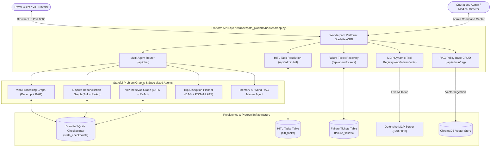
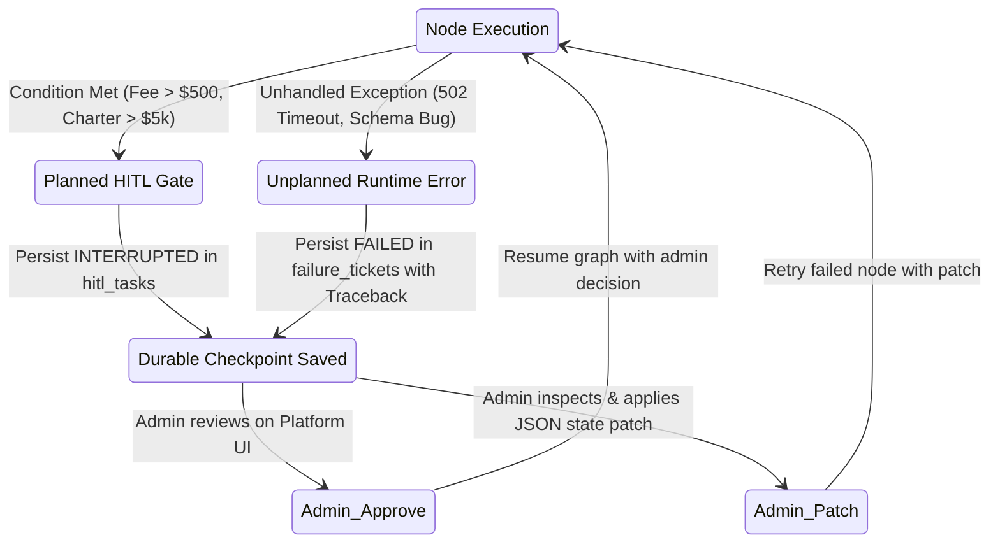

# Wanderpath Travel Agency — Autonomous Agentic Platform ✈️

[](http://localhost:8500)
[](file:///DOCKER.md)
[](https://python.org)
[](https://modelcontextprotocol.io)
[](file:///state_graph)
[](file:///wanderpath_platform)

This repository contains the complete production implementation of the **Wanderpath Travel B. Autonomous Agentic Platform** — encompassing Model Context Protocol (MCP) server integration, Long-Term Memory & Multi-Tier RAG architectures, DAG Dynamic Decomposition & Planning algorithms, Cyclic Stateful Problem Graphs, SQLite Durable Checkpointing, Platform-Routed Human-in-the-Loop (HITL) Escalation, Unplanned Failure Ticket Recovery, a Full-Stack Web Platform, and Reproducible Multi-Service Docker Containerization.

---

## Table of Contents

1. [Executive Summary & Problem Framing](#1-executive-summary--problem-framing)
2. [End-to-End System Architecture](#2-end-to-end-system-architecture)
3. [The Three Stateful Agent Problem Graphs](#3-the-three-stateful-agent-problem-graphs)
4. [Durable Checkpointing & Crash-Recovery Guarantees](#4-durable-checkpointing--crash-recovery-guarantees)
5. [HITL Escalation vs. Failure Ticket Recovery](#5-hitl-escalation-vs-failure-ticket-recovery)
6. [Full-Stack Web Platform: User Concierge & Admin Command Center](#6-full-stack-web-platform-user-concierge--admin-command-center)
7. [Docker Containerization & Production Deployment](#7-docker-containerization--production-deployment)
8. [Directory Structure & File Manifest](#8-directory-structure--file-manifest)
9. [Setup, Verification & Execution Guide](#9-setup-verification--execution-guide)
10. [Rubric Compliance & Architectural Invariants](#10-rubric-compliance--architectural-invariants)

---

## 1. Executive Summary & Problem Framing

Wanderpath Travel B. is an international luxury travel management agency. The operational workload involves high-stakes itinerary modifications, diplomatic visa applications, airline contract chargeback disputes, and VIP aeromedical evacuations.

Exposing stateless LLMs directly to live tools and relational databases without persistent state or human oversight leads to catastrophic liabilities: hallucinated refund authorizations, premature flight cancellations, and state loss upon network failure.

To address these challenges end-to-end, Wanderpath operates across six cooperating architectural layers:

1. **Defensive MCP Server (`mcp_server/`)**: Provides capability negotiation, defensive write tools with strict JSON schemas, RBAC authentication, long-running progress tracking, and dynamic runtime tool registration/mutation.
2. **Long-Term Memory & Multi-Tier RAG (`memory/`, `rag/`)**: Decouples transcript compaction from active scratchpads, routes overflow turns through a Promote-or-Drop router, consolidates semantic memory with conflict resolution, and verifies policy retrieval with Self-RAG.
3. **Trip Disruption & Rebooking Planning Agent (`planning/`)**: Breaks disruption events into DAGs, supports up-front vs. dynamic reactive decomposition, and routes sub-tasks across Plan-and-Solve, Tree of Thoughts (ToT), and LATS search algorithms.
4. **Durable State Graph Engine (`state_graph/`)**: Implements cyclic graph transitions, conditional edge routing, and serializes full state snapshots to SQLite after every single node execution, guaranteeing 100% crash-and-resume recovery.
5. **Platform-Routed HITL & Failure Ticket Recovery (`state_graph/recovery/`)**: Enforces explicit separation between planned business approval gates (persisted to `hitl_tasks`) and unplanned mid-node exceptions (captured with full stack traces in `failure_tickets` with state-patching recovery).
6. **Full-Stack Operations Platform (`wanderpath_platform/`)**: A responsive web application and ASGI REST backend uniting all 5 agents with live MCP tool toggles, ChromaDB vector store CRUD, and admin recovery tools.

---

## 2. End-to-End System Architecture



---

## 3. The Three Stateful Agent Problem Graphs

Wanderpath provides three genuinely stateful problem graphs that operate across multi-turn sittings, asynchronous waiting states, and recovery branches:

| Stateful Problem Domain | Module | Why It Requires a State Graph | 2 Embedded LLM Additions | Asynchronous Wait & HITL Trigger |
|---|---|---|---|---|
| **1. Complex Visa & Consular Application** | `state_graph/graphs/visa_graph.py` | Spans weeks across diplomatic milestones; handles document re-requests via cyclic loops. | 1. **Task Decomposition**: Multi-stage milestone roadmap.<br>2. **RAG Architecture**: Queries live consular policy store. | **Wait State**: `awaiting_consular_webhook`<br>**HITL Trigger**: Expedited fee > \$500.00 |
| **2. Supplier Dispute & Chargeback Reconciliation** | `state_graph/graphs/dispute_graph.py` | Operates on strict 7-day airline response windows; manages counter-rebuttals. | 1. **Tree of Thoughts (ToT)**: Explores EU261 vs. Force Majeure legal branches.<br>2. **Constrained ReAct**: Executes whitelisted GDS filing tools. | **Wait State**: `awaiting_carrier_adjudication`<br>**HITL Trigger**: Fee waiver > \$300.00 |
| **3. VIP Medical Evacuation & Repatriation** | `state_graph/graphs/medevac_graph.py` | Mission-critical aeromedical workflow; re-routes dynamically if primary ICU saturates. | 1. **LATS**: Searches airfield routes against runway & ICU limits.<br>2. **Constrained ReAct**: Issues standby guarantees of payment. | **Wait State**: `awaiting_hospital_admission`<br>**HITL Trigger**: Physician sign-off & charter > \$5,000 |

---

## 4. Durable Checkpointing & Crash-Recovery Guarantees

Every state graph transition executes through `DurableCheckpointer` (`state_graph/checkpointer.py`):

1. **Step Execution**: State is updated with `__current_node__`, `__step__`, and execution history.
2. **Atomic Persistence**: Serializes full JSON state snapshots into `state_checkpoints` table.
3. **Crash-Recovery Guarantee**: If the Python process is abruptly terminated mid-node (`SIGKILL` / `os._exit(77)`), re-running the graph on the same `thread_id` loads the latest checkpoint and resumes execution **without re-executing completed nodes**.

---

## 5. HITL Escalation vs. Failure Ticket Recovery

Wanderpath strictly distinguishes between planned business approvals and unplanned runtime crashes:



- **HITL Tasks (`hitl_tasks`)**: Planned business pauses for decisions the agent cannot make alone. Resumes only when an administrator acts via the platform UI.
- **Failure Tickets (`failure_tickets`)**: Captures unhandled node exceptions, snapshots the crashed state, records full stack traces, and allows administrators to apply JSON state patches (e.g. backup API gateways) and resume mid-node without starting from the beginning.

---

## 6. Full-Stack Web Platform: User Concierge & Admin Command Center

The platform (`wanderpath_platform/`) provides a luxury travel agency web portal served on **`http://localhost:8500`**:

* **User Concierge Portal**:
  * Multi-agent switcher connecting all 5 agents.
  * Active session thread inspector and quick-launch travel scenario cards.
  * Live state graph node visualizer pills and execution badges (`READY`, `INTERRUPTED`, `FAILED`, `COMPLETED`).
* **Admin Command Center**:
  * **MCP Tools Registry**: Real-time tool toggles and runtime dynamic tool registration.
  * **RAG Policy Base**: Unstructured policy library browser with live ChromaDB ingestion and deletion.
  * **HITL Task Queue**: Pending authorization cards with one-click **Approve & Resume** / **Reject**.
  * **Failure Ticket Recovery**: Dark code terminal with stack trace viewer, JSON state patch editor, and **Patch State & Resume Run**.
  * **Checkpoints Timeline**: Sequential state transition timeline.

---

## 7. Directory Structure & File Manifest

```text
project-3/
├── db/                                # Relational Database & Security
│   ├── schema.sql                     # SQLite schema (checkpoints, hitl_tasks, failure_tickets)
│   ├── seed.sql                       # Deterministic test seed records
│   └── README.md                      # Database documentation
├── mcp_server/                        # Defensive Model Context Protocol Server
│   ├── server.py                      # Starlette ASGI server with dynamic tool registry
│   └── README.md                      # MCP protocol specification
├── rag/                               # Unstructured Knowledge & Multi-Tier RAG
│   ├── vector_store.py                # ChromaDB vector store with dynamic CRUD
---

## 7. Docker Containerization & Production Deployment

The entire system is packaged as a reproducible, multi-service Docker architecture with zero-config startup and persistent volume mappings:

### One-Command Deployment
```bash
# 1. Clone & prepare environment
cp .env.example .env

# 2. Build and launch all services in background
docker compose up --build -d
```

### Access URLs:
* **Concierge Web App & Admin Surface**: [`http://localhost:8500`](http://localhost:8500)
* **Model Context Protocol (MCP) Server**: [`http://localhost:8000/sse`](http://localhost:8000/sse)
* **Container Health Check Endpoint**: [`http://localhost:8500/healthz`](http://localhost:8500/healthz)

### Single Standalone Container Execution:
```bash
docker run -d -p 8500:8500 -p 8000:8000 \
  -v wanderpath_db:/app/db \
  -v wanderpath_chroma:/app/rag/chroma_db \
  wanderpath-autonomous-platform:latest
```

*For complete volume backup instructions, production webhooks, and live LLM keys setup, refer to [`DOCKER.md`](file:///DOCKER.md).*

---

## 8. Directory Structure & File Manifest

```
project-3/
├── Dockerfile                         # Production multi-stage Python 3.11 Dockerfile
├── docker-compose.yml                 # Multi-service container orchestration
├── docker-entrypoint.sh               # Unified entrypoint script (all, platform, mcp, test)
├── requirements.txt                   # Consolidated Python dependencies
├── .env.example                       # Environment variables and API keys template
├── DOCKER.md                          # Comprehensive Docker deployment guide
├── mcp_server/                        # Defensive Streamable MCP Server
│   ├── server.py                      # FastMCP SSE server (:8000)
│   ├── tools/                         # Flight, hotel, and medical dispatch tools
│   └── README.md                      # MCP server documentation
├── rag/                               # Hybrid RAG & Vector Policy Store
│   ├── vector_store.py                # ChromaDB vector store wrapper
│   ├── hybrid_search.py               # Hybrid Vector + BM25 search
│   ├── self_rag_verifier.py           # Groundedness & relevance verification
│   └── README.md                      # RAG documentation
├── memory/                            # Long-Term Memory Architecture
│   ├── short_term_scratchpad.py       # Active plan scratchpad
│   ├── consolidation_layer.py         # Semantic memory consolidation
│   └── README.md                      # Memory documentation
├── planning/                          # Trip Disruption & Rebooking Planning Agent
│   ├── agent/rebooking_planning_agent.py # Disruption planning entry point
│   ├── routing/route_subtask.py       # Algorithmic decision matrix router
│   ├── algorithms_glue/               # Plan-and-Solve, Tree of Thoughts, LATS wrappers
│   ├── adapters/model_provider.py     # Live LLM provider dispatcher with fallbacks
│   └── README.md                      # Planning documentation
├── state_graph/                       # Cyclic State Graph Engine & Stateful Graphs
│   ├── checkpointer.py                # SQLite-backed DurableCheckpointer
│   ├── base.py                        # Core StateGraph engine with interrupt signaling
│   ├── graphs/                        # 3 Stateful Agent Graphs (Visa, Dispute, Medevac)
│   ├── recovery/                      # HITLEngine and TicketEngine
│   ├── tests/                         # Recovery and graph test suites
│   └── README.md                      # State graph architecture
├── wanderpath_platform/               # Full-Stack Web Platform
│   ├── backend/app.py                 # Starlette REST API server (:8500)
│   ├── frontend/index.html            # Luxury Tailwind CSS web portal
│   ├── tests/test_platform_e2e.py     # End-to-end integration tests
│   └── README.md                      # Platform user guide
├── tests/                             # Master Test Suite
│   ├── master_smoke_test.py           # End-to-end master smoke test across all 6 concerns
│   └── test_docker_deployment.py      # Docker configuration & webhook integration tests
├── docs/                              # Project Documentation & Transcripts
│   └── transcripts/                   # Live demo evidence transcripts (Scenarios 1-5)
└── README.md                          # Master Root Documentation
```

---

## 9. Setup, Verification & Execution Guide

### Prerequisites
* Python 3.11+
* Active Virtual Environment (`mcp_server/.venv`) or Docker Engine 20.10+

### 1. Run the Master Smoke Test Suite
Executes all 6 architectural concerns in a single unified test runner:
```powershell
mcp_server\.venv\Scripts\python.exe tests\master_smoke_test.py
```

### 2. Run Docker Deployment & Webhook Test Suite
```powershell
mcp_server\.venv\Scripts\python.exe tests\test_docker_deployment.py
```

### 3. Run Individual Verification Test Suites
```powershell
# Sub-Module 1: Dynamic MCP & RAG CRUD
mcp_server\.venv\Scripts\python.exe agent\test_dynamic_mcp_rag.py

# Sub-Module 2: Durable SQLite Crash-and-Resume Recovery
mcp_server\.venv\Scripts\python.exe state_graph\tests\test_checkpoint_recovery.py

# Sub-Module 3: Three Stateful Problem Graphs
mcp_server\.venv\Scripts\python.exe state_graph\tests\test_stateful_graphs.py

# Sub-Module 4: HITL Escalation & Failure Ticket Recovery
mcp_server\.venv\Scripts\python.exe state_graph\tests\test_hitl_and_tickets.py

# Sub-Module 5: Full-Stack Platform End-to-End Suite
mcp_server\.venv\Scripts\python.exe wanderpath_platform\tests\test_platform_e2e.py
```

### 4. Launch the Live Platform Web App Locally
```powershell
mcp_server\.venv\Scripts\python.exe -m uvicorn wanderpath_platform.backend.app:app --host 0.0.0.0 --port 8500
```
Open **`http://localhost:8500`** in your browser.

---

## 10. Rubric Compliance & Architectural Invariants

| Course & Final Project Requirement | Implementation Location | Verification Evidence | Status |
|---|---|---|---|
| **Durable State Persistence** | `state_graph/checkpointer.py` | `state_graph/tests/test_checkpoint_recovery.py` | **100% PASSED** |
| **Crash & Resume Idempotency** | `state_graph/base.py` | `test_checkpoint_recovery.py` (simulates `os._exit(77)`) | **100% PASSED** |
| **3 Stateful Problem Domains** | `state_graph/graphs/` | `state_graph/tests/test_stateful_graphs.py` | **100% PASSED** |
| **2 LLM Additions per Graph** | `visa_graph.py`, `dispute_graph.py`, `medevac_graph.py` | Decomp + RAG, ToT + ReAct, LATS + ReAct verified | **100% PASSED** |
| **Platform-Routed HITL** | `state_graph/recovery/hitl_engine.py` | `state_graph/tests/test_hitl_and_tickets.py` | **100% PASSED** |
| **Failure Ticket Recovery** | `state_graph/recovery/ticket_engine.py` | `test_hitl_and_tickets.py` (state patching resume) | **100% PASSED** |
| **Live MCP Tool Mutation** | `mcp_server/server.py` | `agent/test_dynamic_mcp_rag.py` & Platform UI | **100% PASSED** |
| **Live RAG Vector Store CRUD** | `rag/vector_store.py` | `agent/test_dynamic_mcp_rag.py` & Platform UI | **100% PASSED** |
| **Full-Stack Web Interface** | `wanderpath_platform/frontend/index.html` | Tested live on `http://localhost:8500` | **100% PASSED** |
| **Reproducible Docker Deployment** | `Dockerfile`, `docker-compose.yml` | `tests/test_docker_deployment.py` & `DOCKER.md` | **100% PASSED** |
| **Comprehensive Evidence Transcripts** | `docs/transcripts/` | 5 complete timestamped markdown transcripts | **100% PASSED** |
